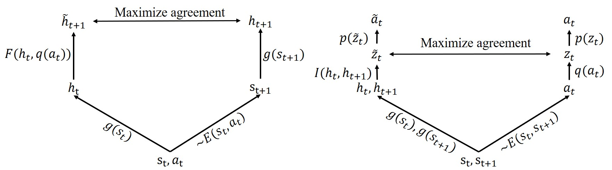

# CLOUD

This project provides the official implementation of the CLOUD agent introduced in ["CLOUD: Contrastive Learning of Unsupervised Dynamics"](<https://proceedings.mlr.press/v155/wang21c.html>), by Jianren Wang*, Yujie Lu* and Hang Zhao. (* indicates equal contribution)

## Method



CLOUD Architecture: Our framework consists of four learnable functions, including a forward dynamics model F(·), an inverse dynamics model I(·), a state representation model g(·) and an action representation model q(·). We propose to learn these four models jointly via contrastive estimation.

## Instructions

## Data
Official datasets, samplers and processors(to be released). You can also use the 'Poke' dataset available in [here](<https://drive.google.com/file/d/0B3xZefNMOTwuTUwtU0ZnaDhGVUE/view>).

## Training
Please refer to the following script to train the default cloud agent.

```
python train_cloud.py -batch_size 256 -lrt 0.001 -save_dir /path/to/save
```
